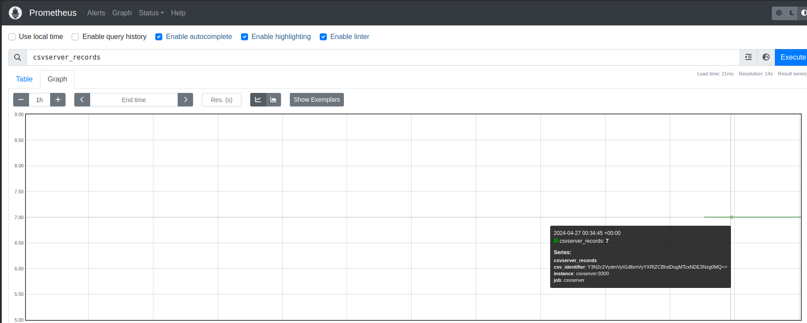

#command history

mkdir csvserver_compose
cd csvserver_compose
touch docker-compose.yaml
mkdir -p csvserver/solution
cd
./gencsv.sh 2 8
docker images
docker-compose up -d
docker ps
docker logs -f f3f1bb1433da
docker-compose down
docker-compose up -d
docker ps
docker-compose up -d
history

 #created as mentioned in project